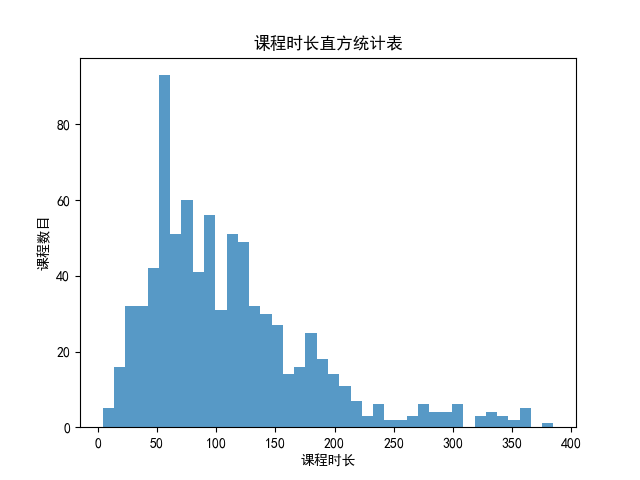

# Course-Analysis-of-IMOOC
基于python,对IMOOC的课程进行数据获取以及分析

## 使用
- 使用bs4，request，re进行IMOOC数据爬取
- pymssql进行数据存储，基于sql server，
- matplotlib和numpy进行数据分析及可视化

## 对IMOOC的的课程进行分析
### 对课程类型的统计图

### 对课程等级的统计图

### 对不同类型课程数目的统计图

### 对课程时长的统计图

### 对课程人数的统计图

### 对课程时长与人数的统计图

### 对课程时长与评分的统计图

### 对课程人数与评分的统计图

